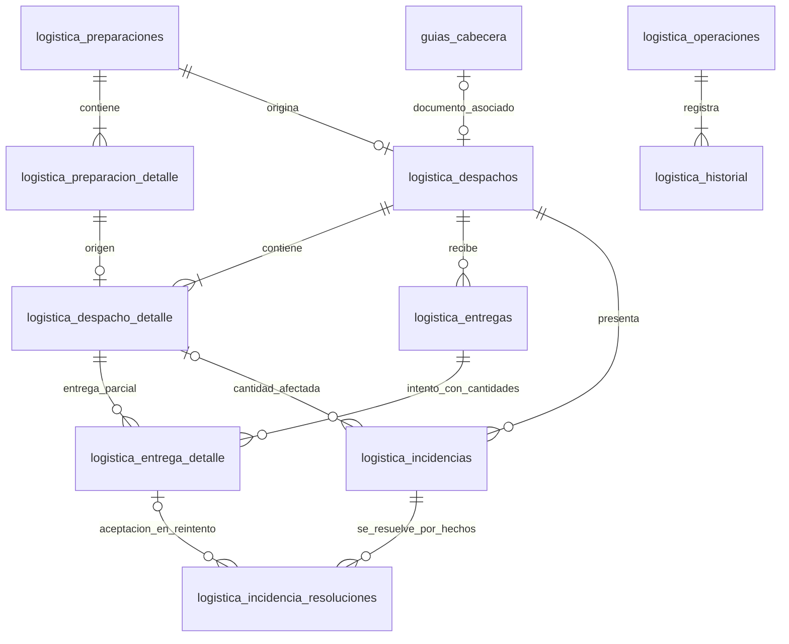

# Modelo de datos de Logística

Base local: `f38f4e8`. Migración inicial `006_logistics_persistence.sql` y evolución `007_logistics_incidents.sql`. La interfaz está en `app/Contracts/LogisticsRepositoryInterface.php`; el contrato 007 prevalece para intentos, incidencias, balances y cierre: `docs/contracts/logistics-incidents.md`. La integración remota avanzó a d0819d4; integrar y verificar con el equipo antes de promover este trabajo.

## Modelo

El diagrama expresa el flujo normal de las escrituras del Repository. Las FKs garantizan identidad y pertenencia a los padres; condiciones como tener al menos un detalle se verifican al guardar el agregado.

| Tabla | Propósito y claves |
| --- | --- |
| logistica_preparaciones | Solicitud operativa con origen externo, sede/almacén, destino, reserva y versión. |
| logistica_preparacion_detalle | Líneas de origen, producto/unidad/lote y cantidad; admite separar una línea externa por lotes. |
| logistica_despachos | Un despacho por preparación y una guía por despacho; referencia de salida, snapshot de guía y versión. |
| logistica_despacho_detalle | Copia de las líneas preparadas con referencia al detalle original. |
| logistica_entregas | Intento con resultado, receptor cuando corresponde y posible anulación restringida. FALLIDA puede no tener líneas. |
| logistica_entrega_detalle | Cantidades aceptadas/rechazadas por línea exacta del despacho. |
| logistica_incidencias | Problema cuantitativo con asignación única, o reporte informativo sin consumo de saldo. |
| logistica_incidencia_resoluciones | Resoluciones parciales con cantidades, aceptación vinculada o confirmaciones externas comprobadas. |
| logistica_operaciones | Clave única por sede, actor/acción, hash normalizado y resultado original para reintentos. |
| logistica_historial | Eventos de negocio enlazados a operación y agregados; solo se añaden desde el Repository. |

Diez tablas, con un único registro técnico de comandos. Los IDs y FKs usan los tipos del schema v2. Cantidades DECIMAL(14,3), versiones INT UNSIGNED, referencias externas VARCHAR(128), destino VARCHAR(500), receptor VARCHAR(200). Claves de operaciones y confirmaciones con comparación binaria. Balance por línea: despachado = aceptado + retornado confirmado + disposición final confirmada + pendiente.

## Integridad y límites

FKs compuestas impiden vincular una entrega al detalle de otro despacho o mezclar la sede del padre con la del hijo. El lote se relaciona con su producto. El Repository valida almacén/sucursal, referencias de guía, cantidades y versión esperada; bloquea el despacho antes de calcular saldos vigentes.

La guía se referencia por su cabecera y versión; al salir se captura snapshot. No se referencia su detalle mediante FK porque el CRUD actual puede reemplazar filas. No se escribe en Stock, Kardex, Ventas ni Compras. Reservas/salidas son coordinadas por Services; resoluciones externas usan el proveedor confiable de Inventarios y guardan confirmaciones granulares únicas. resolucion_ref legado no habilita cierre.

La persistencia logística admite cantidades fraccionarias de hasta tres decimales. El CRUD de Guías en la base revisada valida actualmente cantidades enteras. Alisson debe resolver esa compatibilidad mediante el módulo responsable antes de habilitar despachos fraccionarios en la aplicación; esta entrega no modifica ese CRUD.

## Aplicación de la migración

En una base del ERP que ya contiene schema v2, aplicar 006 y luego 007 mediante el procedimiento del equipo. Si 006 existe, aplicar solo 007. No volver a importar 002 sobre una base existente. Los snapshots 006/007 son copias de sus respectivos pasos, no pasos adicionales. 007 valida datos existentes antes de evolucionar: cierres excepcionales antiguos deben conciliarse, sin inventar confirmaciones.

La migración conserva las tablas existentes y registra la versión 6 en `schema_migrations`. El Repository escribe timestamps UTC explícitos sin modificar la sesión del llamador; `fecha` conserva la fecha operativa que envía el Service. Los defaults SQL usan CURRENT_TIMESTAMP: cualquier inserción directa ajena al Repository requiere sesión UTC. No cargar los datos de pruebas en producción.

Rollback 007 vuelve a 006 solo si no pierde hechos incompatibles: rechaza incidencias/resoluciones y formatos nuevos. Rollback 006 solo corresponde tras revertir 007 y elimina los ocho objetos iniciales; no elimina catálogos ni Guías. Las verificaciones up/down utilizan exclusivamente bases temporales generadas. No forzar rollback borrando evidencia.
